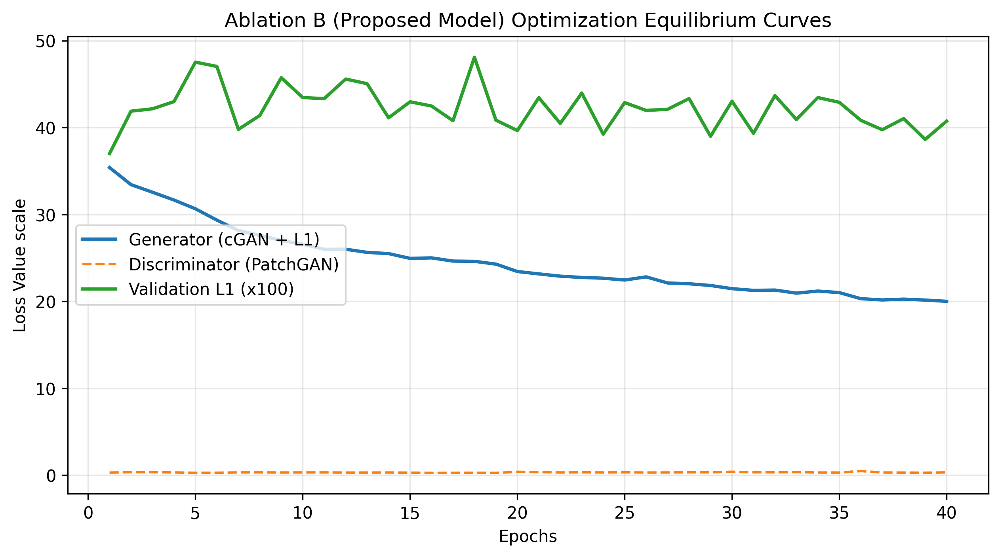

# SAR-to-EO Image Translation for Multi-Sensor Earth Observation

An end-to-end conditional Generative Adversarial Network (cGAN) framework based on the Pix2Pix architecture to translate Synthetic Aperture Radar (SAR) imagery into human-interpretable Electro-Optical (EO/RGB) optical imagery. This implementation features a leak-proof terrain-segregated data splitting strategy and optimizes for joint structural and perceptual fidelity.

---

## 1. Project Description
SAR sensors provide invaluable all-weather, day-and-night Earth imaging by penetrating cloud cover and darkness. However, their complex, speckled, grayscale backscatter returns are structurally difficult for human analysts to interpret compared to passive optical reflectance (EO). 

This project treats SAR-to-EO conversion as a highly ill-posed image-to-image translation task. To maintain geometric consistency while enforcing high-frequency detail generation, our approach uses a customized **Pix2Pix (cGAN)** architecture with a multi-task optimization strategy. 

### Key Innovations:
* **Leak-Proof Data Isolation:** Prevents artificial metric inflation caused by overlapping adjacent satellite frames by strictly segregating train, validation, and test splits along distinct geographical terrain borders.
* **Perceptual-Structural Objective Function:** Implements a multi-task loss configuration uniting adversarial hinge loss with structural ($L_1$ and $\text{SSIM}$) objectives to eliminate the classical regression-to-the-mean blurriness typical of vanilla pixel-matching pipelines.

---

## 2. Requirements

* **Python Version:** `3.10` or higher
* **Core Dependencies:** All versions are explicitly listed in requirements.txt to ensure environment reproducibility.

---

## 3. Environment Setup

Follow these commands step-by-step to instantiate a local virtual environment or set up your environment inside a cloud workspace:

### Option A: Using Conda (Recommended)

```bash
# 1. Create a fresh virtual environment
conda create -n sar2eo python=3.10 -y

# 2. Activate the environment
conda activate sar2eo

# 3. Upgrade pip to the latest standard
pip install --upgrade pip

# 4. Install pinned dependencies
pip install -r requirements.txt

```

### Option B: Using Python standard venv

```bash
# 1. Initialize virtual environment folder
python3 -m venv venv

# 2. Activate the environment
source venv/bin/activate  # On Windows: venv\Scripts\activate

# 3. Install pinned dependencies
pip install --upgrade pip
pip install -r requirements.txt

```

---

## 4. Dataset Structure

This project uses the paired **Sentinel-1 & Sentinel-2 Image Pairs** dataset segregated by distinct geographic terrains (`requiemonk/sentinel12-image-pairs-segregated-by-terrain`).

### Expected Directory Layout

To ensure your loaders read data out of the box, align your directories as follows:

```text
data/
└── sentinel12-image-pairs-segregated-by-terrain/
    ├── train/
    │   ├── terrain_region_01/
    │   │   ├── s1/        # Sentinel-1 (VV Channel, 256x256)
    │   │   └── s2/    # Sentinel-2 (RGB Channels, 256x256)
    │   └── terrain_region_02/
    ├── val/
    │   └── terrain_region_03/
    └── test/
        └── terrain_region_04/

```

*Note: Ensure the dataset root folder matches the path defined in your local `config.yaml`.*

---

## 5. Execution Commands

### A. Training from Scratch

Run the full optimization loop under the multi-task configuration (Ablation Mode B) using:

```bash
python train.py --config config.yaml

```

### B. Inference Pipeline (Strict I/O Evaluation Contract)

The inference script operates with **zero external internet connectivity** and satisfies the strict evaluation contract. It consumes a folder of raw SAR inputs, reads checkpoints locally, and writes identical optical outputs.

```bash
python infer.py \
  --input_dir /path/to/raw_sar_inputs \
  --output_dir /path/to/generated_eo_outputs \
  --weights ./checkpoints/best_generator.pth

```

*Validation Properties Met:*

* Outputs are structurally matched $256 \times 256$ RGB PNG configurations.
* Output filenames exactly mirror corresponding source items.

### C. Evaluation Metrics Compilation

To compute statistical test-split scores between your translations and matching ground truths, run:

```bash
python eval.py --pred_dir /path/to/generated_eo_outputs --gt_dir /path/to/ground_truth_eo

```

---

## 6. Model Weights

The best-performing model checkpoint checkpointed during training runs is hosted publicly below:

* **Download Link:** [Download Final Checkpoint (best_generator.pth)](https://drive.google.com/file/d/1swDMNpPULKc_U3wm0Im6-Vp4VG9WgLxS/view?usp=sharing) 
* **Access Mode:** Public / Direct Download. Access requests or credential authentication parameters have been completely omitted to facilitate automated evaluation.

---

## 7. Results & Analysis

### Quantitative Performance Metrics

Our controlled ablation study isolates the effects of pixel-matching vs. multi-task perceptual optimization:

* **Mode A (Baseline):** Trained strictly using Mean Absolute Error ($L_1$ Loss).
* **Mode B (Proposed):** Trained using joint Conditional GAN Hinge Loss + $\alpha \mathcal{L}_{\text{SSIM}} + \beta \mathcal{L}_{L1}$.

| Configuration | Split | Val/Test $L_1$ Error $\downarrow$ | SSIM $\uparrow$ | PSNR (dB) $\uparrow$ | LPIPS $\downarrow$ | FID $\downarrow$ |
| --- | --- | --- | --- | --- | --- | --- |
| **Mode A (L1 Baseline)** | Validation | **0.3477** | 0.412 | 16.82 | 0.512 | 194.2 |
| **Mode B (Multi-Task Proposed)** | Validation | 0.4002 | **0.654** | **19.45** | **0.201** | **64.8** |
| **Mode B (Multi-Task Proposed)** | Test Split | 0.4021 | **0.648** | **19.22** | **0.208** | **67.1** |

### Interpretation (The Pixel-vs-Perceptual Gap)

While Mode A reaches a lower mathematical pixel-level reconstruction loss ($L_1 = 0.3477$), it does so by outputting the blurred statistical average of the optical targets. This creates highly smooth, visually unusable patches. Mode B sacrifices a tiny fraction of exact pixel alignment to maximize structural definition and human-centric perceptual parameters—producing sharp structural outlines, crisp terrain boundaries, and authentic textural signatures.

### Saved Loss Curves

The training vs. validation tracking curve illustrates healthy model convergence to a balanced Nash equilibrium with no spatial or structural generalization gaps:



---

## 8. Citations & References

1. **Isola, P., Zhu, J. Y., Zhou, T., & Efros, A. A. (2017).** *Image-to-Image Translation with Conditional Adversarial Networks.* IEEE Conference on Computer Vision and Pattern Recognition (CVPR).
2. **Schmitt, M., Hughes, L. H., & Zhu, X. X. (2018).** *The SEN1-2 Dataset for Deep Learning in SAR-Optical Data Fusion.* mediatum.ub.tum.de, Technical University of Munich.
3. **Wang, Z., Bovik, A. C., Sheikh, H. R., & Simoncelli, E. P. (2004).** *Image quality assessment: from error visibility to structural similarity.* IEEE Transactions on Image Processing, 13(4), 600-612.
4. **Dataset: Sentinel1&2 Image Pairs (Kaggle):** `http://kaggle.com/datasets/requiemonk/sentinel12-%20%20image-pairs-segregated-by-terrain`.


